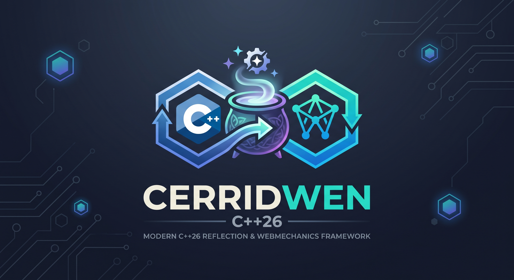

# Cerridwen

<p align="center">
  
</p>

Cerridwen is a modern, high-performance C++26 framework designed to securely expose C++ classes to WebAssembly (WASM) and allow WebAssembly plugins to be loaded seamlessly within native applications. By leveraging C++26 reflection (`std::meta`), Cerridwen automatically generates bindings, trampolines, and proxy classes without requiring external AST parsers or boilerplate code.

## The Mythos

In Celtic mythology, **Cerridwen** is a powerful enchantress and the keeper of the cauldron of knowledge, inspiration, and transformation (the *Awen*). The potion brewed within her cauldron grants profound wisdom and the ability to shape-shift into any form.

We chose this name because the framework acts as a modern cauldron of transformation for C++ applications. By brewing C++ code with WebAssembly, Cerridwen transforms static, monolithic host applications into dynamic, extensible platforms. It securely confines untrusted WebAssembly plugins while granting them the "wisdom" to interoperate seamlessly with complex C++ class hierarchies, seamlessly shifting shapes across the WebAssembly/Native boundary. 

## Key Features

* **C++26 Reflection (`std::meta`)**: Automatically analyzes your C++ class structures at compile time to generate bridging code for WebAssembly, eliminating the need for SWIG or manual binding layers.
* **Full Inheritance Support**: Natively supports Single Inheritance, Multiple Inheritance, and Virtual Inheritance across the WebAssembly boundary. The framework automatically adjusts `this` pointers when dispatching calls from WASM plugins back to the host C++ objects.
* **Virtual Method Overrides (Trampolines)**: WebAssembly plugins can subclass C++ classes and override virtual methods. When the C++ host calls a virtual method, Cerridwen's generated trampolines dynamically route the execution into the WASM sandbox and marshal the return values back.
* **Proxy-Based Data Marshalling**: Complex C++ data members (strings, vectors, custom structs) are safely marshaled between the host and plugins using Reference Proxies and memory offset mapping, ensuring minimal allocations and robust memory bounds checking.
* **Multi-Threading & Concurrency Gating**: Since WebAssembly instances are inherently single-threaded, Cerridwen provides multi-threading models (`[[=cerridwen::thread_safe{}]]`) to safely gate, lock, and serialize access when multiple native C++ threads invoke WebAssembly plugins concurrently.
* **Test-Driven Design**: Built with rigorous TDD principles to guarantee absolute memory safety when bridging native C++ with sandboxed plugins.

## ⚡ Quick Start

Cerridwen relies heavily on C++26 structural annotations to guide the compile-time generation of WebAssembly bindings.

```cpp
#include <cerridwen/annotations.hpp>
#include <string>
#include <iostream>

// 1. Export the C++ Interface to WebAssembly
struct CERRIDWEN_EXPORT_WASM PluginInterface {
    virtual ~PluginInterface() = default;

    // A virtual method that the WebAssembly plugin will implement
    virtual void process_data(int input) = 0;
};

// 2. Export a Host interface to allow the plugin to call back
struct CERRIDWEN_EXPORT_HOST LoggerHost {
    virtual ~LoggerHost() = default;
    virtual void log_message(const char* msg) {
        std::cout << "[Host] Plugin logged: " << msg << "\n";
    }
};
```

To load and interact with the plugin from your host application, use `Wasm3Instance`:

```cpp
#include <cerridwen/wasm3_instance.hpp>

int main() {
    // Load the WebAssembly module securely
    auto instance = std::make_unique<cerridwen::Wasm3Instance>("my_plugin.wasm");
    
    // Bind host classes so the plugin can invoke them
    bind_LoggerHost(instance->get_module()); // Automatically generated!
    
    // Instantiate the exported C++ class implementation from the plugin
    uint32_t ptr = instance->call_create("PluginInterface_create");
    
    // Use the generated Trampoline class to interface with the WASM object
    PluginInterface_Trampoline plugin;
    plugin._wasm_instance = instance.get();
    plugin._wasm_ptr = ptr;
    
    // Call the virtual method. The execution securely drops into the WebAssembly sandbox!
    plugin.process_data(42); 
    
    return 0;
}
```

## Advanced Data Marshalling

Cerridwen uses structural annotations to control how data is transferred between native memory and the WebAssembly linear memory block.

* `CERRIDWEN_MARSHAL_BY_VALUE`: Copies the data directly into the WASM linear memory. Suitable for primitives and trivially copyable structs.
* `CERRIDWEN_MARSHAL_BY_REF`: Creates a safe proxy handle inside the WASM module. When WASM accesses the field, it traps back to the host, ensuring the WebAssembly module never directly reads out-of-bounds host memory.

## Building the Framework

Cerridwen utilizes CMake and requires GCC 16 (for `-std=c++26 -freflection`). 

### Windows (MSYS2 / CrossOver)
```cmd
.\build.bat
```

### Linux / macOS
```bash
./build.sh
```

### Docker (Cross-Platform Linux Builds)
To test Linux builds natively on macOS/Windows using Docker:
```bash
./scripts/run_linux_tests_docker.sh
```

## Requirements

* **Compiler**: GCC 16.1.0+ (requires `-freflection` flag for P2996 support).
* **Language Standard**: C++26
* **WebAssembly Runtime**: Wasm3 (a fast C API compliant interpreter, automatically fetched via CMake).

## License
Cerridwen is licensed under the GNU Affero General Public License v3.0.
